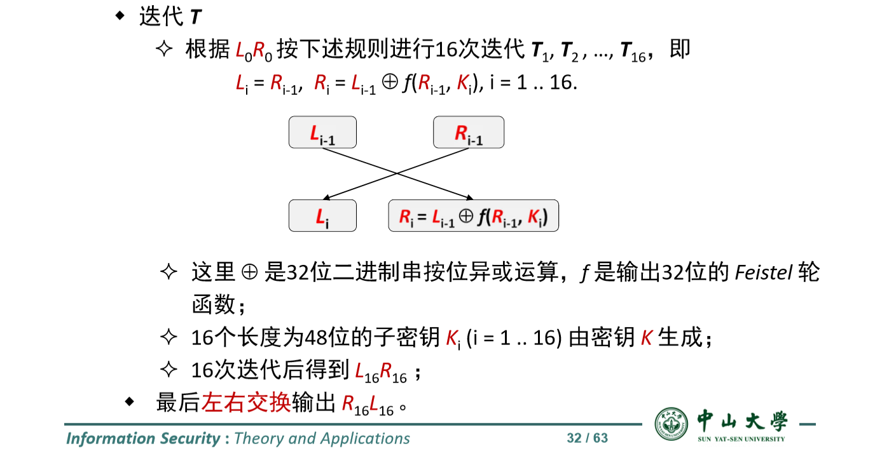
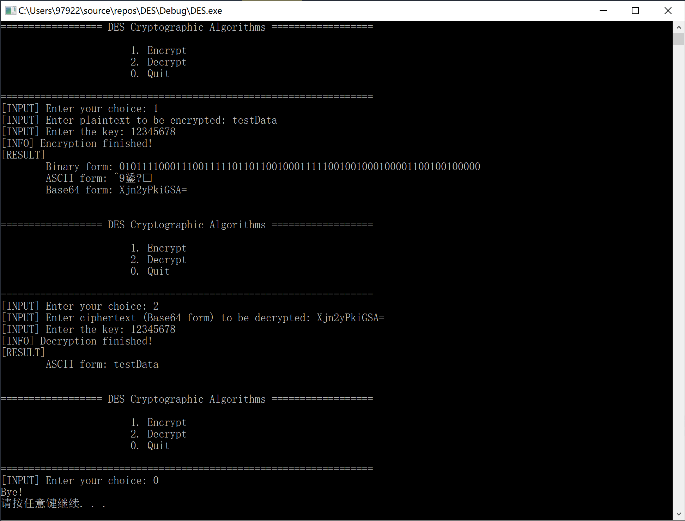

# 中山大学数据科学与计算机学院本科生实验报告


课程名称：**信息安全技术**                       任课教师：**蔡国扬**

| 年级 | 17级        | 专业（方向） | 软件工程             |
| :--- | :---------- | ------------ | -------------------- |
| 学号 | 17343130    | 姓名         | 徐肯                 |
| 电话 | 15057212086 | Email        | **979223119@qq.com** |


## Assignment 1

> 实验内容：使用C语言实现DES 算法

#### 算法原理概述

> DES（Data Encryption Standard）加密算法是一种使用密钥加密的对称、块加密算法。

DES算法以下特点：

- 块加密：以64位为分组长度。64位（8字节）一组的明文作为算法的输入，通过一系列复杂的操作，输出同样64位长度的密文。 
- 对称加密：加密和解密使用相同密钥。密钥同样为64位，每8位中最后1位为奇偶校验位，因此实际有效密钥长度为56位。。密钥可以是任意的56位的数，且可 随时改变。其中极少量的数被认为是弱密钥，但能容易地避开 它们。所有的保密性依赖于密钥。 
- 算法的基本过程就是一些换位和置换的过程。

由于算法细节叙述起来篇幅过长，下文会对算法做一些简单的介绍。

#### 总体结构

##### 流程图（来自网络）


可以看到，算法本身还是很好理解的，后续的实际编写过程也是一步一步照着流程图写完即可。

对于流程图中每一步的具体解释见下面的模块分解。

#### 模块分解

按照算法的流程，总体上我们可以分解得到以下模块：

##### 子密钥生成模块

> 输入：64位密钥
> 
>输出：16个48位的子密钥

该模块负责由给定的64位密钥生成16个48位的子密钥，子密钥会在迭代时使用到。

###### 子密钥生成流程


##### IP置换模块

> 输入：64位明文（密文）
>
> 输出：64位中间结果

该模块只是进行按照固定的表，进行简单的换位操作

##### 迭代模块

> 输入：经过IP置换后的前后32位
>
> 输出：经过一系列变换后的前后32位（在变换的最后需要交换前后32位）

迭代模块按照固定的规则会进行16次迭代（循环），每次迭代的操作对象是对于上一次迭代得到的结果，每次迭代的不同点在于：16次迭代按顺序分别使用不同的子密钥，加密时为正序，解密时为倒叙。

迭代规则如下图所示：



##### Feistel模块

> 输入：32位串和16个48位子密钥之一
>
> 输出：32位串

该模块模拟Feistel函数，会被迭代模块调用。Feistel函数流程如下：


首先对于输入的32位串进行E扩展，将得到48位结果与子密钥进行按位异或运算。然后将异或得到的结果按每组6位分成8组，每个分组经过不同的S盒进行6-4转换，再连接得到4*8共32位串，最后对于32位串做一次P-置换得到最终输出。

##### IP-1逆置换模块

> 输入：上述步骤得到的64位中间结果
>
> 输出：64位密文（明文）

该模块只是进行按照固定的表，进行简单的换位操作

#### 数据结构

本程序没有使用到特殊的数据结构。只需要对于算法中会使用到的一些表进行预先记录，可方便后续的操作。以初始IP置换为例，相应的IP表定义如下：

```c
int IP[] = {
	58, 50, 42, 34, 26, 18, 10, 2,
	60, 52, 44 ,36, 28, 20, 12, 4,
	62, 54, 46, 38, 30, 22 ,14, 6,
	64, 56, 48, 40, 32, 24, 16, 8,
	57, 49, 41, 33, 25, 17, 9,  1,
	59, 51, 43, 35, 27, 19, 11, 3,
	61, 53, 45, 37, 29, 21, 13, 5,
	63, 55, 47, 39, 31, 23, 15, 7 };
```

#### C语言源代码

下面对于一些相关模块的源代码进行一个简单分析，其中可能会使用到一些工具函数，不保证与之前的分析完全一致。完整源代码见一同上交的`src`目录。

##### 子密钥生成模块

```c
void genereteSubKeys(int* key, int subKeys[][48])
{
	int realKey[56] = { 0 };
	int left[28] = { 0 };
	int right[28] = { 0 };
	int subKey[48] = { 0 };
	
	// PC-1置换
	for (int i = 0; i < 56; i++)
		realKey[i] = key[PC_1[i] - 1];

	// 循环产生16个子密钥
	for (int round = 0; round < 16; round++) {
		for (int i = 0; i < 28; i++)
			left[i] = realKey[i];
		for (int i = 28; i < 56; i++)
			right[i - 28] = realKey[i];

		// 对前、后28位进行循环左移
		leftShift(left, leftShiftBits[round]);
		leftShift(right, leftShiftBits[round]);
		for (int i = 0; i < 28; i++)
			realKey[i] = left[i];
		for (int i = 0; i < 28; i++)
			realKey[i + 28] = right[i];

		// PC-2压缩置换
		for (int i = 0; i < 48; i++)
			subKey[i] = realKey[PC_2[i] - 1];
		
		for(int i = 0; i < 48; i++)
			subKeys[round][i] = subKey[i];
	}
}
```

注释已经很清楚解释了该函数的步骤。

##### 初始IP置换模块

```c
void IP_Transform(int* src)
{
	int temp[64];
	for (int i = 0; i < 64; i++)
		temp[i] = src[i];
	for (int i = 0; i < 64; i++)
		src[i] = temp[IP[i] - 1];
}
```

IP表已经定义了变换后与变换前的位置关系，因此只需要简单的赋值即可。后面的IP-1逆置换同理，就不再赘述了。

##### 迭代模块

```c
void T_Iterations(int* left, int* right, int subKeys[][48], int isEncrypt)
{
	int leftTemp[32], rightTemp[32];
	int feistelResult[32];
	
	//共十六次迭代
	for (int i = 0; i < 16; i++) {
		if (isEncrypt)
			feistel(right, subKeys[i], feistelResult);
		else
			feistel(right, subKeys[15 - i], feistelResult);
		for (int j = 0; j < 32; j++) {
			leftTemp[j] = right[j];
			rightTemp[j] = left[j] ^ feistelResult[j];
		}
		for (int j = 0; j < 32; j++) {
			left[j] = leftTemp[j];
			right[j] = rightTemp[j];
		}
	}
}
```

该函数通过`isEncrypt`参数判断当前是加密还是解密。二者唯一的区别就是十六次迭代时所用的子密钥顺序相反。

##### Feistel模块

```c
void feistel(int* R, int* K, int* res)
{
	int E[48];
	int S[32];
	
	// E-扩展成48位
	for (int i = 0; i < 48; i++)
		E[i] = R[E_Expend[i] - 1];

	// 与48位子密钥作按位异或运算
	for (int i = 0; i < 48; i++)
		E[i] = E[i] ^ K[i];

	// 进行S盒变换成32位
	for (int i = 0; i < 8; i++) {
		//得到相应S盒对应位置的十进制数
		int row = E[i * 6] * 2 + E[i * 6 + 5];
		int col = E[i * 6 + 1] * 8 + E[i * 6 + 2] * 4 + E[i * 6 + 3] * 2 + E[i * 6 + 4];
		int S_BoxValue = S_Box[i][row][col];

		//将十进制数转换成对应4位二进制
		for (int j = 3; j >= 0; j--) {
			S[i * 4 + j] = S_BoxValue % 2;
			S_BoxValue /= 2;
		}
	}

	// 进行P置换
	for (int i = 0; i < 32; i++)
		res[i] = S[P_Transform[i] - 1];
}
```

注释已经很清楚解释了该函数的步骤。

#### 编译运行结果

> 测试环境：Windows 10，Microsoft Visual Studio 2017
>
> 程序解释：
>
> + 默认输入都是以字符形式的（就算输入数字也算字符）。由于每个字符占一字节（8位），因此对于64位的密钥只需要输入长为8的字符串（8 * 8 = 64）即可，如下图所示的`12345678`。
>
> + 加密：目前只支持对于长度恰好为8的字符串进行加密（同理，8 * 8 = 64），如下图所示的`testData`。加密结果以三种方式呈现：64位二进制，字符串以及Base64编码形式。
> + 解密：考虑到输入64位二进制或者输入乱码的字符串都比较麻烦，解密设置为需要输入Base64编码的形式。（测试时最好输入之前加密得到的Base64结果，因为这个结果当好对应长度为8的字符串，输入其他不保证正确性）。解密结果以字符串形式呈现。

测试结果：



上图对应测试步骤：

+ 首先输入`1`选择加密功能，并输入要加密的文本`testData`和加密密钥`12345678`，可以看到输出的三种加密结果；
+ 然后输入`2`选择解密功能，我们选择之前加密得到的Base64结果`Xjn2yPkiGSA=`作为输入，并输入同样的密钥`12345678`，可以看到，解密后的结果为`testData`，结果正确；
+ 最后输入`0`退出。

测试通过。