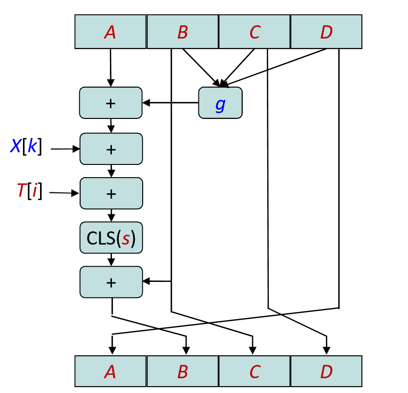

# 中山大学数据科学与计算机学院本科生实验报告


课程名称：**信息安全技术**                       任课教师：**蔡国扬**

| 年级 | 17级        | 专业（方向） | 软件工程             |
| :--- | :---------- | ------------ | -------------------- |
| 学号 | 17343130    | 姓名         | 徐肯                 |
| 电话 | 15057212086 | Email        | **979223119@qq.com** |


## Assignment 2

实验内容：完成一个MD5 算法的程序设计和实现。

### 算法原理概述

> MD5信息摘要算法，( Message-Digest Algorithm 5)，是一种被广泛使用的密码散列函数，可以产生出一个128位（16字节）的散列值，用于确保信息传输完整一致。

MD5算法使用little-endian（小端模式，即低位字节存在内存低地址），输入任意不定长度信息，算法都首先将其以512-bit进行分组（不足补位），每个512-bit的分组都和四个32-bit的数据一起，进行4次大循环（共64次迭代），并更新这四个32-bit数据。当所有分组都经过上述操作后，最后得到的四个32-bit联合输出固定的128位信息摘要。

#### 算法基本流程

算法的基本过程为：填充、分块、缓冲区初始化、循环压缩、得出结果。 


### 总体结构

MD5算法的总体结构如上图所示，结构应该还算是比较清晰的。与上次的DES加密算法不同，MD5的主体只有一个压缩函数，我们只需要写好这个函数中的内容，其他都比较简单。

我认为最主要的关键点有两个：

+ 如何对于数据的填充和分块，特别是当输入是以一个文件而不是一个短字符串的形式时；
+ 如何进行算法中的64次迭代。

下面对于算法的流程进行一些简单的说明：

#### 数据填充和分块

在长度为 K-bit 的原始消息数据尾部填充长度为 P-bit 的标识 100…0（一位1后面接若干位0），1 < P < 512（即至少要填充1个bit），使得填充后的消息位数为：K + P $\equiv$ 448 (mod 512).  **其中，如果当 K $\equiv$448 (mod 512)  时，需要P = 512。**

再向上述填充好的消息尾部附加 K 值的低64位(即K mod $2^{64}$)， 最后得到一个总长度位数为K + P+ 64 $\equiv$ 0 (mod 512) 的消息。 

得到填充完毕后的消息以后，我们就可以将其恰好分为 L 个 512-bit 的分组。（同时每个分组也可以再细分成16个 32-bit 的小分组，在程序中我们可以使用一个数组保存起来，这在后续的压缩循环中会使用到）

#### 初始化

初始化一个128-bit 的 MD 缓冲区，初始记为CV0，可以表示成4个32-bit 寄存器（A, B, C, D），后续的迭代始终在 MD 缓冲区进行，最后一步的128-bit 输出即为MD5算法的结果。

CV0的初始值为IV。寄存器(A, B, C, D) 置16进制初值作为初始向量IV，并采用小端存储(little-endian) 的存储结构（Intel x86系列CPU原本就采用Little Endian 方式存储）：

+ A= 0x67452301 
+ B= 0xEFCDAB89
+ C= 0x98BADCFE 
+ D= 0x10325476

#### 压缩循环

经过上述初始化步骤后，就可以开始执行算法的总体部分了，也就是压缩函数。

压缩函数每次都从CV（即上文提到的 128-bit 缓冲区）输入128位，从之前分好的消息分组中按顺序输入512位，完成4轮循环后，得到该轮压缩的128位结果，加到原来的缓冲区中，然后用下一分组继续上述步骤。（**说具体一点，就是函数每次都从缓冲区(A, B, C, D)拿到四个数a, b, c, d，然后对于a, b, c, d进行压缩循环操作，把最后得到的结果a, b, c, d加到原来的(A, B, C, D)中，下一次函数执行再从(A, B, C, D)中拿数据**）

上文提到函数共4轮循环，其中每轮循环分别固定不同的生成函数F, G, H, I，结合指定的T表元素T[]和消息分组的不同部分X[]做16次迭代运算， 生成下一轮循环的输入。即**4轮循环共有64次迭代运算**。每轮的逻辑如下：




##### 生成函数`g`


##### X[k]

定义为当前处理消息分组的第k个(k= 0..15) 32位字（上文曾提到要将512-bit的分组再分为16个 32-bit 的小分组）。

k值的选取，设 j = i - 1：

+ 第1轮循环：k = j，即顺序使用X[0, 1, 2, 3, 4, 5, 6, 7, 8, 9, 10, 11, 12, 13, 14, 15] 
+ 第2轮循环：k = (1 + 5j) mod 16，即顺序使用X[1, 6, 11, 0, 5, 10, 15, 4, 9, 14, 3, 8, 13, 2, 7, 12] 
+ 第3轮循环：k = (5 + 3j) mod 16，即顺序使用X[5, 8, 11, 14, 1, 4, 7, 10, 13, 0, 3, 6, 9, 12, 15, 2] 
+ 第4轮循环：k= 7j mod 16，即顺序使用X[0, 7, 14, 5, 12, 3, 10, 1, 8, 15, 6, 13, 4, 11, 2, 9]

##### T[i] 

T 表的第i个元素，每个元素为32位字；T表总共有64个元素，也称为加法常数。具体数值由于篇幅限制不再列出，具体可见程序。

##### CLS(s)

循环左移s位。64次迭代中，每一次迭代左移的位数s如下：

+ s[ 1..16] = { 7, 12, 17, 22, 7, 12, 17, 22, 7, 12, 17, 22, 7, 12, 17, 22 } 
+ s[17..32] = { 5, 9, 14, 20, 5, 9, 14, 20, 5, 9, 14, 20, 5, 9, 14, 20 } 
+ s[33..48] = { 4, 11, 16, 23, 4, 11, 16, 23, 4, 11, 16, 23, 4, 11, 16, 23 } 
+ s[49..64] = { 6, 10, 15, 21, 6, 10, 15, 21, 6, 10, 15, 21, 6, 10, 15, 21 }

##### 加法

循环中的加号表示的是模$2^{32}$ 加法。

### 模块分解

按照算法的流程以及实际程序编写的需要，总体上我们可以分解得到以下模块：

#### 读取文件和补位模块

为了更贴合实际情况，本程序实现对于文本文件中内容的散列值计算，即可以支持任意位数字符。

我们无需按照死板的思维，一开始就马上统计文件所包含的比特数，然后马上计算出该如何如何进行补位。实际上，正是由于文件指针的存在，使得我们可以对于整个文件进行实时处理，也就是说我们只需要维护一个count变量，其初始值等于0。而我们每次读取文件64个字节（8*64=512），然后对于读到的这个消息分组即时进行压缩，同时累计位数到count上，直到我们读到文件的末尾，意味着此时不足512字节了。注意，由于我们一直在统计读到的位数，那么此时我们就得到了文件总大小，然后就可以对于最后的不足512bit的部分进行相应的补位操作了。

本文对应的程序就使用了上述方法。

#### 主循环模块

主循环就是上文提到的压缩循环部分，输入为文件读取模块得到的512bit文本数据和上一轮循环得到的CV值(A, B, C, D)，经过64次迭代后更新CV值，用于下一次新的循环。最终，随着文本读取的结束，也就得到了最终结果。

#### 输入输出模块

输入输出模块就比较简单了，由用户输入要进行处理的文件，最后输出得到的结果（32个16进制数的形式）。

### 数据结构

本程序中没有使用到特殊的数据结构。只需要对于算法中会使用到的一些表和运算进行预先记录，可方便后续的操作，例如前文提到的生成函数、T表、循环左移的s值等等。

### C语言源代码

注释已经比较详细，这里不再进行说明。

##### md5.h

```c
#define _CRT_SECURE_NO_WARNINGS

#ifndef MD5_H
#define MD5_H

#include <stdio.h>
#include <stdlib.h>
#include <string.h>
#include <stdint.h>

// MD5压缩函数4轮循环中使用的生成函数，每轮不同
#define F(b, c, d) (((b) & (c)) | ((~b) & (d)))
#define G(b, c, d) (((b) & (d)) | ((c) & (~d)))
#define H(b, c, d) ((b) ^ (c) ^ (d))
#define I(b, c, d) ((c) ^ ((b) | (~d)))

// 循环左移
#define LEFTROTATE(num, n) (((num) << n) | ((num >> (32 - n))))

// T表，32位字，一共有64个元素，对应64次迭代，也成为加法常数
const uint32_t T[64] = { 0xd76aa478, 0xe8c7b756, 0x242070db, 0xc1bdceee,
						0xf57c0faf, 0x4787c62a, 0xa8304613, 0xfd469501,
						0x698098d8, 0x8b44f7af, 0xffff5bb1, 0x895cd7be,
						0x6b901122, 0xfd987193, 0xa679438e, 0x49b40821,
						0xf61e2562, 0xc040b340, 0x265e5a51, 0xe9b6c7aa,
						0xd62f105d, 0x02441453, 0xd8a1e681, 0xe7d3fbc8,
						0x21e1cde6, 0xc33707d6, 0xf4d50d87, 0x455a14ed,
						0xa9e3e905, 0xfcefa3f8, 0x676f02d9, 0x8d2a4c8a,
						0xfffa3942, 0x8771f681, 0x6d9d6122, 0xfde5380c,
						0xa4beea44, 0x4bdecfa9, 0xf6bb4b60, 0xbebfbc70,
						0x289b7ec6, 0xeaa127fa, 0xd4ef3085, 0x04881d05,
						0xd9d4d039, 0xe6db99e5, 0x1fa27cf8, 0xc4ac5665,
						0xf4292244, 0x432aff97, 0xab9423a7, 0xfc93a039,
						0x655b59c3, 0x8f0ccc92, 0xffeff47d, 0x85845dd1,
						0x6fa87e4f, 0xfe2ce6e0, 0xa3014314, 0x4e0811a1,
						0xf7537e82, 0xbd3af235, 0x2ad7d2bb, 0xeb86d391 };

// 64次迭代运算采用的左循环移位的s值
const uint32_t S[64] = { 7, 12, 17, 22, 7, 12, 17, 22, 7, 12, 17, 22, 7, 12, 17, 22,
						 5,  9, 14, 20, 5,  9, 14, 20, 5,  9, 14, 20, 5,  9, 14, 20,
						 4, 11, 16, 23, 4, 11, 16, 23, 4, 11, 16, 23, 4, 11, 16, 23,
						 6, 10, 15, 21, 6, 10, 15, 21, 6, 10, 15, 21, 6, 10, 15, 21 };

// 两个工具函数
void int2byte(uint32_t val, uint8_t *bytes)
{
	bytes[0] = (uint8_t)val;
	bytes[1] = (uint8_t)(val >> 8);
	bytes[2] = (uint8_t)(val >> 16);
	bytes[3] = (uint8_t)(val >> 24);
}

uint32_t byte2int(const uint8_t *bytes)
{
	return (uint32_t)bytes[0]
		| ((uint32_t)bytes[1] << 8)
		| ((uint32_t)bytes[2] << 16)
		| ((uint32_t)bytes[3] << 24);
}

// MD5主函数
int MD5(const uint8_t* filepath, uint8_t *result) {
	FILE *fp = NULL;
	uint8_t buffer[64];
	uint8_t* temp = NULL;
	size_t count = 0, offset, i; // count用于记录总长度，补位的时候需要用到
	uint32_t X[16];
	int flag = 0;

	if ((fp = fopen(filepath, "rb+")) == NULL) {
		printf("[ERROR] File in %s not found.", filepath);
		return 0;
	}

	// MD缓冲区CV，迭代在缓冲区进行
	uint32_t A, B, C, D;
	// 初始向量IV，采用小端存储（Intel x86系列原本就采用了Little Endian方式存储）
	A = 0x67452301;
	B = 0xEFCDAB89;
	C = 0x98BADCFE;
	D = 0X10325476;

	while (!feof(fp)) {
		memset(buffer, 0, sizeof(buffer));
		// fread函数返回读取的次数，设定每次读取一个字符，就可以知道字符长度了
		int len = fread(buffer, 1, 64, fp);
		// 更新文件总长度
		count += len;
		// 当读取文件到末尾时，意味着需要进行补位操作了，此时读到的len可能不足512bit，也可能刚好等于512bit
		if (feof(fp)) {
			flag = 1;

			// 因为恰好等于448bit不行，所以new_len直接等于len+1
			int new_len;
			for (new_len = len + 1; new_len % 64 != 56; new_len++)
				;

			// 还要增加64bit
			temp = (uint8_t*)malloc(new_len + 8);
			memcpy(temp, buffer, len);

			// 填充1000...0
			temp[len] = 0x80;
			for (offset = len + 1; offset < new_len; offset++)
				temp[offset] = 0;

			// 在末尾再附加总长度count的低64位，由于这里的count单位是byte，所以要乘以8
			int2byte(count * 8, temp + new_len);
			int2byte(count >> 29, temp + new_len + 4); //参考了其他代码，count>>29相当于count*8>>32，但可以避免值溢出
			len = new_len;
		}

		// 虽然每次只读取512bit，但是还是采用这样的方式，可以防止最后的一次由于补位导致可能出现的 len > 512bit 的情况（此时就要分两次了）
		for (offset = 0; offset < len; offset += 64) {
			// 读到结尾时，我们把补位后的数据存在了temp中，为了处理的统一，将temp中的数据保存到buffer上
			if (flag == 1) {
				memcpy(buffer, temp + offset, 64);
			}

			// 保存512位的每32位分组，在X[k]时会用到
			for (int i = 0; i < 16; i++) {
				X[i] = byte2int(buffer + i * 4);
			}

			uint32_t a, b, c, d, temp, g, k;
			a = A;
			b = B;
			c = C;
			d = D;

			// 主循环，共四轮，每轮16次迭代，共64次迭代
			for (i = 0; i < 64; i++) {
				if (i < 16) {
					g = F(b, c, d);
					k = i;
				}
				else if (i < 32) {
					g = G(b, c, d);
					k = (1 + 5 * i) % 16;
				}
				else if (i < 48) {
					g = H(b, c, d);
					k = (5 + 3 * i) % 16;
				}
				else {
					g = I(b, c, d);
					k = (7 * i) % 16;
				}
				temp = d;
				d = c;
				c = b;
				b = b + LEFTROTATE((a + g + X[k] + T[i]), S[i]);
				a = temp;
			}

			A += a;
			B += b;
			C += c;
			D += d;

		}
	}
	
	// 文件读取结束，释放内存
	free(temp);

	// 把128位的最终结果转化为字节形式
	int2byte(A, result);
	int2byte(B, result + 4);
	int2byte(C, result + 8);
	int2byte(D, result + 12);

	return 1;
}

#endif // !MD5_H
```

##### main.c

```c
#include "md5.h"

int main() {
	printf("\n================== MD5 Message-Digest Algorithm ==================\n\n");
	printf("[INPUT] Enter the filepath: ");
	
	// 输入文件路径
	char filepath[256];
	scanf("%s", filepath);

	// 128位结果
	uint8_t result[16];
	int i;

	// 返回值不等于1表示有错误
	if (MD5(filepath, result) == 1) {
		printf("\n[INFO] The result is: ");

		//将字节通过无符号十六进制输出
		for (i = 0; i < 16; i++) {
			printf("%2.2x", result[i]);
		}
		printf("\n");
	}

	system("pause");
	return 0;
}
```

### 编译运行结果

> 运行环境：:computer:Windows 10 1903
>
> IDE：Visual Studio 2017
>
> 测试方式：和[网上的已有MD5在线算法]( https://www.sojson.com/encrypt_md5.html  )得到的结果进行比较，验证正确性。
>
> 注意：在使用本程序时，需要将文件放在正确的路径下

#### 测试结果

##### 短字符串

使用短字符`Hello World!`进行测试：


##### 长字符串

使用长达157个字符的字符串进行测试：


与网上的结果均一致，测试通过。